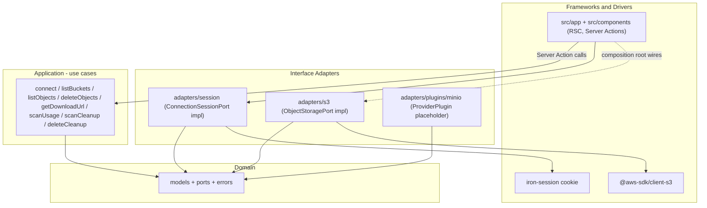

# Inari — S3 Management Service Consolidated Plan

## 1. Purpose

Provide a single long-term reference for Inari, a standalone Next.js service for
managing S3-compatible object storage (MinIO today, vendor-neutral by design).
It consolidates the greenfield service plan, the Cleanup Planner extension, the
download-link feature, and the two later revisions to how the object browser
hands out paths and download URLs.

## 2. Source Scope

Consolidated from `docs/plans/manuscripts/` (5 drafts, `README.md` excluded):

| Manuscript                            | Topic                                          |
| ------------------------------------- | ---------------------------------------------- |
| `20260630-s3-manager-ssr.md`          | Greenfield service, Clean Architecture mapping |
| `20260630-cleanup-planner.md`         | Cleanup Planner v1.1 (`/cleanup`)              |
| `20260709-download-link.md`           | Direct + presigned download links              |
| `20260728-copy-prefix-path-button.md` | Copy the current location from the breadcrumbs |
| `20260728-lazy-presigned-urls.md`     | Sign presigned URLs on demand, not per listing |

Where the drafts disagree, the later and more explicit decision wins; the
supersessions are recorded in section 4 so the reasoning is not lost.

## 3. Consolidated Background

Inari is a browser UI for operators who need to inspect, share, and clean up
objects in an S3-compatible store. It is single-user and session-scoped: the
user supplies connection credentials on `/connect`, they are sealed into an
encrypted cookie, and every storage call happens server-side.

The product grew in three layers. First a browsing/deletion core (buckets,
prefix navigation, filter/sort, batch delete, manual usage scan). Then the
Cleanup Planner, which reuses the same storage port to rank deletion candidates
across buckets. Then download links, which let a user hand an object to someone
else either as a direct URL or a presigned one.

The two July 28 drafts correct the object browser's sharing ergonomics. Copying
a location previously meant hand-selecting breadcrumb text, and presigned mode
signed every visible object on every listing — work that was wasted because
downloading from the web UI is a low-frequency action.

## 4. Confirmed Decisions

**Platform and layering**

- Next.js App Router with `src/`, TypeScript strict, Tailwind, `lucide-react`,
  `zod`, `@aws-sdk/client-s3`, `iron-session`; Vitest as the test runner.
- The spec's `src/server/s3` / `src/components` / `src/lib` sketch is reconciled
  into Clean Architecture layers per
  [`docs/standards/architecture.md`](../standards/architecture.md).
- Pages live under the guarded `(app)` route group with **colocated**
  `actions.ts` per route (superseding the original single `src/app/actions/`
  directory).
- No AWS SDK call ever appears in a React component.

**Credentials and session**

- Credentials live only in an `iron-session` sealed cookie encrypted with
  `SESSION_SECRET` (>= 32 chars), `httpOnly` / `secure` / `sameSite=lax`,
  decrypted only inside Server Actions and Route Handlers. Never localStorage,
  never a database. Disconnect clears the session.

**Cleanup Planner**

- No new ports or adapters: cleanup is domain models plus use cases over the
  existing `ObjectStoragePort`.
- Time filtering uses `lastModified`, because S3 has no universal creation time.
- v1.1 scan strategy is collect-matching → global sort → `slice(maxResults)`
  (default 1000), with the memory caveat documented.
- Per-bucket failures become warnings and are skipped; an all-buckets scan still
  returns.
- Deletion groups candidates by bucket and requires typing `DELETE` in a
  confirmation modal showing the per-bucket breakdown.

**Download links**

- Direct Link is the product default and is built client-side from the
  connection's non-secret `endpoint` + `forcePathStyle`, so it costs no request.
- Presigned URLs are signed server-side only. Default lifetime 1h; options are
  15m / 1h / 6h / 24h.
- Mode and expiry persist in the `s3m_download` cookie, read during SSR so the
  first paint is correct (mirrors the theme cookie pattern).
- **Presigned URLs are signed on demand only** — superseding the original
  "presign every visible object" design. The batch `createPresignedUrlsAction`
  was deleted: nothing called it, it accepted an unbounded `keys` array, and
  every exported Server Action is a reachable RPC endpoint.
- A presigned link has four states; `idle` (presigned mode, nothing signed yet)
  is distinct from `loading`, and only `loading` disables the Copy/Open buttons.
  Without that distinction lazy signing would leave every button permanently
  disabled.
- Signed URLs are cached in memory per key and reused until within
  `EXPIRY_SKEW_MS` (60s) of expiry; changing the expiry setting wipes the cache.
  Concurrent requests for one key share a single in-flight promise.
- An `error` entry is not fresh, so the next click retries.

**Copying a location**

- The breadcrumb trail ends with a copy button that yields
  `s3://<bucket>/<prefix>`, trailing `/` kept, unencoded — the audience is a
  human pasting into a chat message or an `aws s3` command.
  - Superseded: an earlier revision copied the bare `prefix`; the user asked for
    the bucket to be included and was indifferent to, but happy with, the
    `s3://` scheme.
- Rendered at the bucket root too, where `s3://<bucket>/` is still meaningful.
- One format only; no picker, to keep the breadcrumb row uncluttered.

## 5. Architecture and Design Principles

Dependencies point inward only. `domain` imports no framework, no AWS SDK, and
no Next.js.



- **Composition root**: a Server Action reads the session, builds the S3 adapter
  through the client factory, constructs the use case, runs it, and returns
  domain types.
- **Plugin seam**: a `ProviderPlugin` port with a MinIO placeholder. The core
  works fully without it; Settings shows "MinIO plugin not configured".
- **Error normalization**: `s3_error_mapper` converts AWS / network / TLS errors
  into the domain `StorageError` union, which the UI renders as messages.
- **Pure logic lives in `src/lib`** (`buildDirectUrl`, cleanup ranking,
  formatting), which is also where the unit tests concentrate.
- **Naming**: Next.js special files keep their required names; other modules use
  `snake_case` with PascalCase component exports.

## 6. Functional Scope

- `/connect` — endpoint + credentials, test connection, prefilled default
  endpoint.
- `/buckets` — bucket list.
- `/buckets/[bucket]` — object browser: prefix navigation via breadcrumbs,
  server-side pagination by continuation token, client-side filter/sort over the
  loaded page set, multi-select, batch delete with confirmation and per-key
  result, per-object download links, copy-location button, and a detail drawer.
- `/cleanup` — Cleanup Planner: scope selection, scan options, ranked candidate
  table with reason badges, warnings, selection summary, per-bucket delete
  confirmation.
- `/admin/usage` — manual usage scan with progress and an estimate disclaimer.
- `/settings` — preferences and the MinIO plugin shell.
- Cross-cutting: dark theme by default with a light toggle, responsive layout,
  lucide icons, toast feedback, transport-agnostic clipboard copy.

## 7. Constraints and Rules

- The secret never leaves the server: no credential text in responses, no full
  presigned URL or signature in logs, no stack traces in the UI.
- Filtering and sorting apply to the currently loaded pages only; the UI must
  say so rather than implying server-side query support.
- `DeleteObjects` is chunked at the S3 1000-key limit.
- `ListObjectsV2` uses `Delimiter: '/'` for browsing; an empty delimiter means a
  flat recursive listing and is reserved for scans.
- The presigned URL cache is client memory only and is discarded on navigation
  or disconnect; it is never persisted.
- Usage and cleanup scans are manual only — no background jobs in this scope.
- A single all-buckets scan over very large buckets can be slow or hit
  serverless limits; accepted for v1.1.

## 8. Data Model and Format Notes

```text
S3Connection       { endpoint; accessKeyId; secretAccessKey; region; forcePathStyle; createdAt; lastUsedAt }
BucketSummary / ObjectSummary / ObjectListPage / UsageSummary / DeleteResult
StorageError       discriminated union of Error subclasses

CleanupScope       { bucket?: string; prefix?: string }   // prefix reserved
CleanupScanOptions { minSizeBytes?: number; olderThan?: Date; maxResults: number }
CleanupCandidate   { bucket; key; sizeBytes; lastModified; storageClass?; reasons: string[] }
CleanupWarning     { bucket: string; message: string }
CleanupPlanSummary { scannedBuckets; scannedObjects; candidateCount; candidateTotalSize }
CleanupPlan        { scope; options; candidates; summary; warnings; scannedAt }

ObjectDownloadLink { mode; url?; status: idle|ready|loading|error; expiresAt?; message? }
```

- Cleanup ordering: `lastModified` ASC, `size` DESC, `bucket` ASC, `key` ASC.
- Direct URL: path-style `endpoint/bucket/key`, virtual-host `bucket.host/key`.
- Shared location string: `s3://<bucket>/<prefix>`, unencoded, trailing `/`.
- `s3m_download` cookie: `"<mode>:<expiry>"`, malformed values fall back to
  defaults so a bad cookie never breaks rendering.

## 9. CLI / API / Config Notes

- **Env**: `SESSION_SECRET` (>= 32 chars, required) and a default S3 endpoint
  prefilled on `/connect`.
- **Cookies**: the sealed session cookie; `s3m_download` for link preference;
  a theme cookie read by the root layout for flash-free SSR.
- **S3 operations used**: `ListBuckets`, `HeadBucket`, `ListObjectsV2`
  (delimiter + continuation token), `DeleteObjects`, and `getSignedUrl` for
  presigning. The S3 client uses signature v4, `forcePathStyle: true`, and
  region defaulting to `us-east-1`.
- **Server Actions** (colocated per route): list a page, delete objects, presign
  one download URL, scan usage, scan cleanup, delete cleanup candidates. Every
  exported action is a public RPC endpoint, so unused ones are removed rather
  than left in place.
- Presigning is a local SigV4 computation and issues no request to the object
  store.

## 10. Implementation Plan

Phases 1–10 (core service) and 11–16 (Cleanup Planner) are complete; 17–19
cover the download-link work and its two corrections.

1. Skeleton: Next.js, TypeScript, Tailwind, theme, icons, layout and states.
2. Domain layer: models, ports, errors, session port, lib utilities.
3. Connection: `/connect`, iron-session, S3 client factory, test connection.
4. Bucket list.
5. Object browser with prefix navigation and pagination.
6. Filter / sort / selection toolbar.
7. Delete with confirmation modal and result report.
8. Usage scan.
9. Settings and the MinIO plugin shell.
10. Cross-cutting error normalization, tests, lint / format / typecheck.
11. Cleanup domain models and pure ranking/reason helpers.
12. `scan_cleanup` use case.
13. Cleanup UI: scope, options, candidate table, badges, warnings.
14. Selection, summary panel, group-by-bucket preview.
15. Delete integration with the per-bucket confirmation modal.
16. Prefix-ready cleanup domain with the UI field disabled.
17. Download links: `buildDirectUrl`, preference cookie, link context, per-row
    actions, drawer download section, toolbar mode/expiry controls.
18. Copy-location button on the breadcrumbs.
19. On-demand presigning: drop the auto-presign effect and the batch action,
    add the `idle` state and per-key request de-duplication.

Every phase is verified with `npm run typecheck`, `npm run lint`,
`npm run format:check`, and `npm test`.

## 11. Non-goals

- Multi-user authentication, roles, or long-term secret storage.
- Background scans or scheduled jobs; cached or persisted plans.
- Object preview, upload, or multipart management.
- MinIO user/policy administration, lifecycle or versioning editors,
  Prometheus metrics.
- Anonymous-access detection, bucket policy/ACL editing, permanent share links,
  URL shortening, password-protected download pages, whole-bucket presigning,
  CDN URLs, MinIO-specific sharing, bulk export.
- Prefix/folder cleanup UI, streaming top-k, scan progress or cancel, CSV
  export (deferred, see Future Work).
- Persisting generated presigned URLs, and any change to direct-link mode.

## 12. Open Questions

- **Popup blocking on Open Link.** Opening a presigned link now always awaits a
  Server Action round trip before `window.open`, relying on the browser's
  transient user activation (about 5s in Chrome). Strict blockers may reject the
  new tab. The workaround — open a blank tab first, then redirect it — requires
  dropping `noopener`. Pending real-world feedback before taking that trade.
- **When to enable prefix-scoped cleanup.** `CleanupScope.prefix` is honored by
  the use case but the UI field ships disabled with a "Coming soon" note.
- **Large all-buckets scans.** The v1.1 collect-then-slice strategy is accepted
  but unbounded in memory and wall time; the trigger for moving to the streaming
  design is not defined.

## 13. Future Work

- Cleanup v1.2: streaming top-k, scan progress and cancellation, CSV export.
- Reuse the download-link feature inside the Cleanup Planner.
- Grow the MinIO plugin beyond the placeholder.
- Enable the prefix-scoped cleanup UI once the reserved domain field is
  exercised.
